<!-- you found the source. good instinct. -->


 

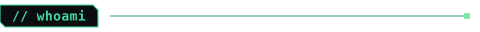

> I find the cracks before anyone else does — internal networks, web apps, real adversary emulation. And I build what I tear apart.

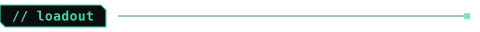

 

 

 

 

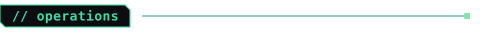

<table>
<tr>
<td width="50%" valign="top">

**[Mustang-Panda-Emulation](https://github.com/SUDORM0X/Chinese-APT-Mustang-Panda-Emulation)**
Full-chain APT emulation — VS Code reverse shell → code exec + payloads.

</td>
<td width="50%" valign="top">

**[OracleBuster](https://github.com/SUDORM0X/OracleBuster)**
Oracle DB security testing — brute-force over IP / port / SID / creds.

</td>
</tr>
<tr>
<td width="50%" valign="top">

**[W3B_Expl0it_TOOL](https://github.com/SUDORM0X/W3B_Expl0it_TOOL)**
Python web-exploitation tools.

</td>
<td width="50%" valign="top">

**[PoC-CVE-2018-15473](https://github.com/SUDORM0X/PoC-CVE-2018-15473)**
PoC — OpenSSH username enumeration.

</td>
</tr>
</table>

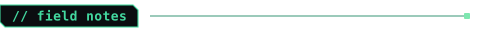

- **[AD-WIN-EXPLOITATION](https://github.com/SUDORM0X/AD-WIN-EXPLOITATION)** — Active Directory & Windows exploitation
- **[Port-Swigger-Web-Exploit-Note](https://github.com/SUDORM0X/Port-Swigger-Web-Exploit-Note)** — PortSwigger lab notes
- **[OSCP-Preparation](https://github.com/SUDORM0X/OSCP-Preparation---Mariosk0x)** — OSCP methodology & prep

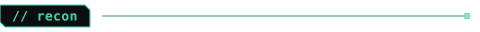

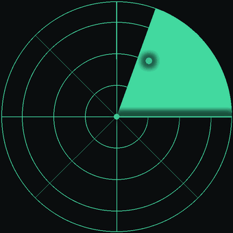

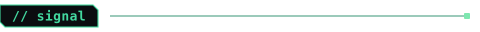

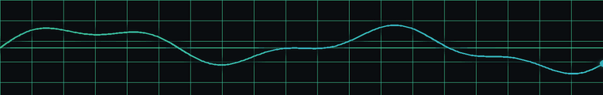

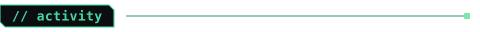

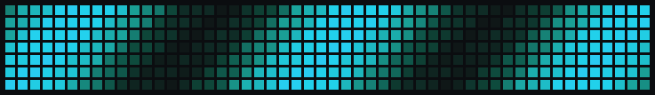

 

🔒 research & authorized pentesting only

