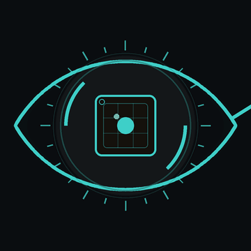

<div align="center">



# SUDORM0X

**offensive security engineer · full-stack dev**


</div>

```console
$ whoami
offensive security engineer — trovo le crepe prima che lo facciano altri.
reti interne · applicazioni web · emulazione di avversari reali.
e costruisco le stesse applicazioni che poi metto sotto stress.
```

---

<div align="center">

### 🧰 Stack

**Languages**
<br>


**Frontend**
<br>


**Backend & Data**
<br>


**Security & Recon**
<br>


</div>

---

### 📂 Progetti

| Repo | Cosa fa |
| :--- | :--- |
| [**Mustang-Panda-Emulation**](https://github.com/SUDORM0X/Chinese-APT-Mustang-Panda-Emulation) | Emulazione full-chain dell'APT Mustang Panda — abuso del reverse shell di VS Code per code execution e deploy di payload contro target governativi. |
| [**OracleBuster**](https://github.com/SUDORM0X/OracleBuster) | Bash tool per il security testing di database Oracle: brute-force configurabile su IP, porte, SID e credenziali. |
| [**W3B_Expl0it_TOOL**](https://github.com/SUDORM0X/W3B_Expl0it_TOOL) | Raccolta di tool Python per web exploitation. |
| [**PoC-CVE-2018-15473**](https://github.com/SUDORM0X/PoC-CVE-2018-15473) | Proof-of-concept per CVE-2018-15473 — username enumeration su OpenSSH. |

### 📝 Research & note

| Repo | Argomento |
| :--- | :--- |
| [**AD-WIN-EXPLOITATION**](https://github.com/SUDORM0X/AD-WIN-EXPLOITATION) | Active Directory & Windows exploitation. |
| [**Port-Swigger-Web-Exploit-Note**](https://github.com/SUDORM0X/Port-Swigger-Web-Exploit-Note) | Note tecniche sui lab PortSwigger Web Security Academy. |
| [**OSCP-Preparation**](https://github.com/SUDORM0X/OSCP-Preparation---Mariosk0x) | Metodologia e preparazione OSCP. |

---

<div align="center">


🔒 Tutto il materiale è a scopo di ricerca e penetration testing autorizzato.

</div>
